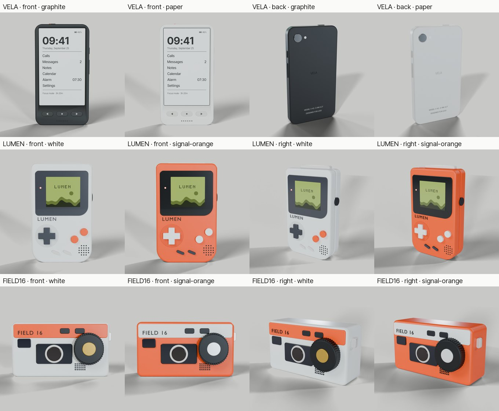
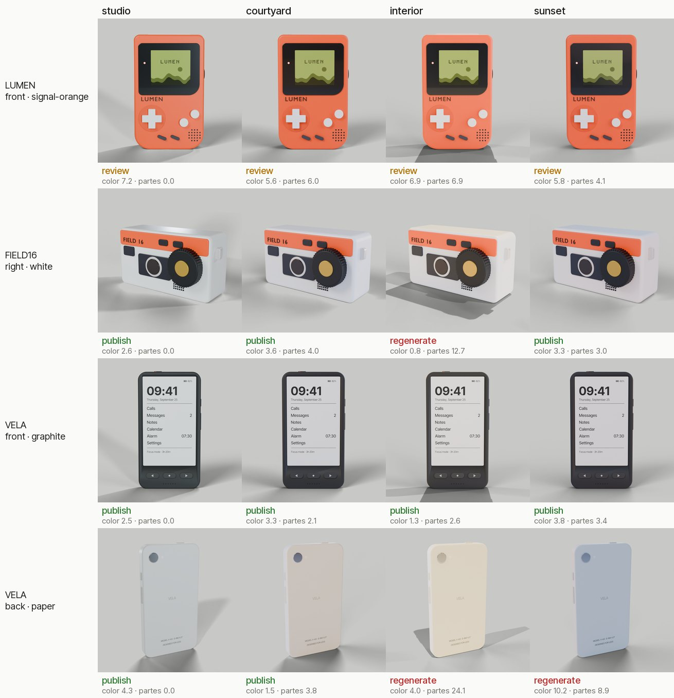
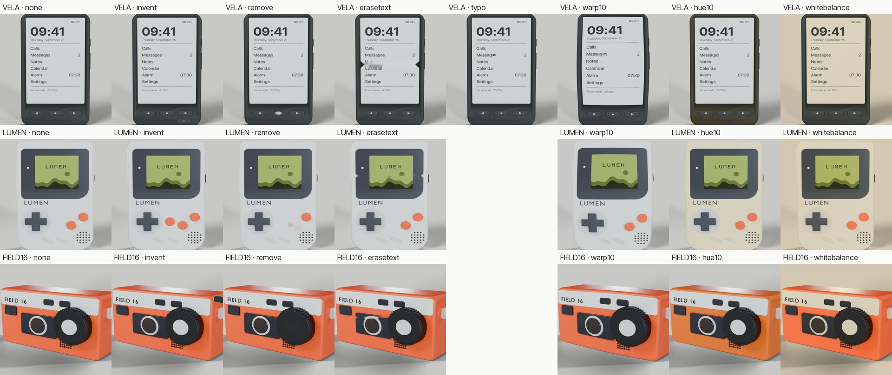
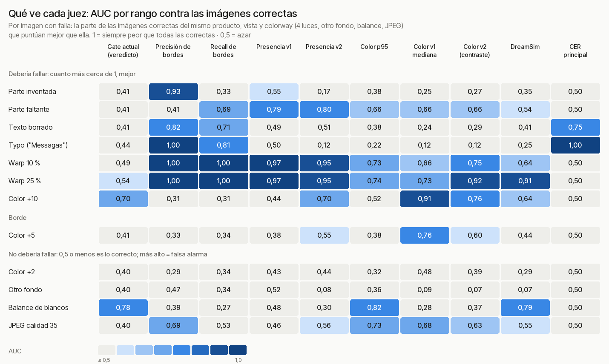
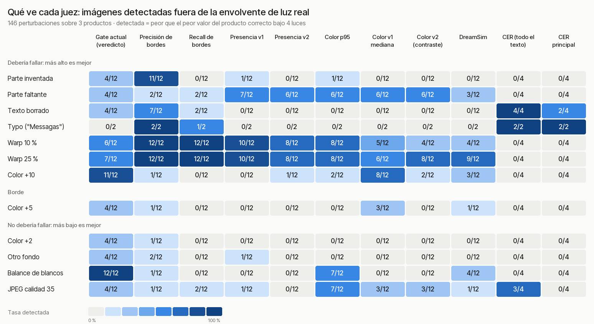
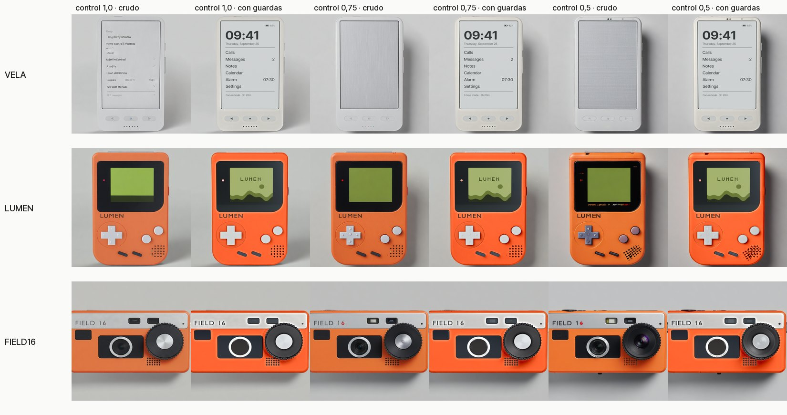
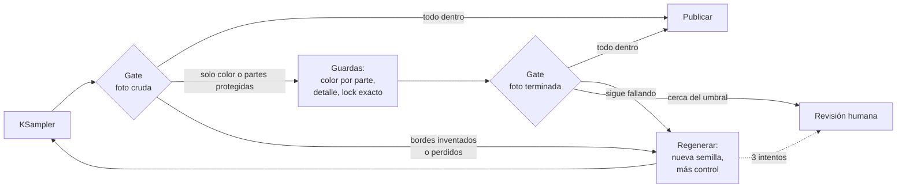
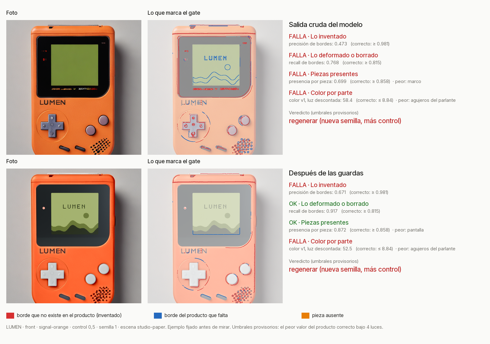

# Cómo mantener un producto consistente en un workflow de diseño generativo

> Informe de investigación · 25 de septiembre de 2026 · Estado: **fases 0, 1 y 2 terminadas** (productos, línea base de variación real, selección de métricas y 180 generaciones medidas). Falta el etiquetado humano.
> Este archivo se genera: `research/INFORME.template.md` + `research/results.json` → `research/INFORME.md` (con `research/scripts/render_report.py`). Ningún número está escrito a mano.
> Las fuentes, con links verificados, están en [`LITERATURE.md`](LITERATURE.md). Las condiciones y métricas, en [`PROTOCOL.md`](PROTOCOL.md).

---

## Resultados hasta ahora

| Fase | Qué es | Estado |
|---|---|---|
| 0 | Portar el pipeline de From CAD to Shelf, construir VELA, pases, línea base de variación real | Terminada |
| 1 | Batería de métricas por región y perturbaciones con falla conocida | Terminada: batería elegida para la fase 2 |
| 2 | Generar 180 imágenes con SDXL local (fallas naturales) y medirlas | Terminada |
| 3 | Etiquetado humano, calibración con LUMEN, gate v1 congelado, evaluación con FIELD 16 + VELA | **Siguiente: necesita tus etiquetas** |
| 4 | Estudio B en nano-banana-2 (pago, con aprobación) | Pendiente |

### Los tres productos

Los tres son inventados y se construyen en código, así la geometría es exacta. VELA es el caso elegido para romper los métodos: su pantalla es casi solo texto y su espalda lleva serigrafía.

### Fase 0: el gate actual ante el producto correcto bajo otra luz

**Qué se hizo.** Se renderizaron 48 imágenes del producto correcto: 3 productos × 2 vistas × 2 colorways × 4 luces de estudio (studio, courtyard, interior y sunset, que son HDRI de Blender). Se juzgaron con el gate de From CAD to Shelf (`qa.check`, sin modificar). Como el producto es correcto en todas, la respuesta correcta es siempre *publish*.

**Resultado.** El gate publicó **23 de 48**: mandó 18 a revisión y 7 a regenerar.

| Luz | Publicadas |
|---|---|
| studio (la luz de la referencia) | 8 / 12 |
| courtyard | 7 / 12 |
| interior | 2 / 12 |
| sunset | 6 / 12 |

**Lectura.**
- **El color naranja nunca pasa.** Los renders signal-orange se publicaron 0 de 16 veces; los demás colorways, 23 de 32. Pasa incluso con la luz de la propia referencia: el color de los naranjas en studio queda entre 5.6 y 8.3 ΔE, por encima del umbral de 5. El gate compara contra el color del spec, y el tone mapping del render (AgX) desatura el naranja. La nota de From CAD to Shelf ya lo mencionaba, pero el umbral no lo contempla.
- **"Partes" no mide la foto.** Con la luz de la referencia da como máximo 0.0, porque compara la imagen consigo misma. Con otra luz llega a 26.7. En el pipeline se mide después de volver a pegar las partes desde el render, así que mide el pegado. Además, como incluye la luminosidad, la dispara cualquier cambio de luz.

**Límites.** Son renders, no fotos generadas: miden cuántos falsos rechazos provoca la luz sola. Que el producto es correcto está garantizado por construcción, pero una persona podría rechazar una imagen muy teñida por la luz (VELA Paper bajo *interior*). Eso lo va a decidir el etiquetado. La HDRI llamada *sunset* deja el render más frío, no más cálido.

### Fase 1: qué ve cada métrica

**Qué se hizo.** A cada render de referencia se le aplicó una falla conocida (146 imágenes en total), o un cambio que no debería contar como falla:

- **Fallas:** parte inventada, parte faltante, texto borrado, typo en la pantalla de VELA, warp y corrimiento de color.
- **Cambios legítimos:** otro fondo, otro balance de blancos y compresión JPEG.

Cada imagen, junto con las 48 de variación de luz, se midió con el gate actual y con los candidatos de la batería (`metrics/battery.py`):

| Candidato | Qué mide | Lado |
|---|---|---|
| Precisión de bordes | Bordes de la foto que no existen en el render (partes, grillas o letras inventadas) | Lo que sobra |
| Recall de bordes | Bordes del render que faltan en la foto | Lo que falta |
| Presencia v1 | Por pieza (un botón, una tecla): parte de sus píxeles que se parecen más a la pieza que a su entorno, después de sacar el tinte de la luz | Lo que falta |
| Presencia v2 | Lo mismo, pero con el contraste relativo pieza/entorno | Lo que falta |
| Color p95 (v0) | Tono y croma por píxel contra el spec, percentil 95 | Color |
| Color v1 mediana | Tono y croma contra el render, después de sacar el tinte de la luz usando el resto del producto | Color |
| Color v2 | Cociente de color entre la parte y el resto del producto, foto contra render | Color |
| DINOv2 / DreamSim | Identidad global del recorte del producto | Global |
| CER principal | Error de caracteres del OCR en el texto grande (solo VELA) | Texto |

**Cómo se lee, sin elegir umbrales a ojo.** Cada imagen con falla se compara contra las imágenes correctas del mismo producto, vista y colorway: las 4 luces, otro fondo, balance de blancos y JPEG. Se cuenta qué parte de esas imágenes correctas puntúa mejor que la imagen con falla. El promedio es un **AUC por rango**:
- **1** significa que la falla siempre queda peor que todas las correctas: la métrica la separa.
- **0,5** es azar: la métrica no la ve.

En las filas de cambios legítimos, lo correcto es 0,5 o menos, y un valor alto es una falsa alarma.

La misma tabla en texto

| Perturbación | ¿Debería fallar? | Gate actual (veredicto) | Precisión de bordes | Recall de bordes | Presencia v1 | Presencia v2 | Color p95 | Color v1 mediana | Color v2 (contraste) | DreamSim | CER principal |
|---|---|---|---|---|---|---|---|---|---|---|---|
| Parte inventada | sí | 0.41 | 0.93 | 0.33 | 0.55 | 0.17 | 0.38 | 0.25 | 0.27 | 0.35 | 0.50 |
| Parte faltante | sí | 0.41 | 0.41 | 0.69 | 0.79 | 0.80 | 0.66 | 0.66 | 0.66 | 0.54 | 0.50 |
| Texto borrado | sí | 0.41 | 0.82 | 0.71 | 0.49 | 0.51 | 0.38 | 0.24 | 0.29 | 0.41 | 0.75 |
| Typo ("Messagas") | sí | 0.44 | 1.00 | 0.81 | 0.50 | 0.12 | 0.22 | 0.12 | 0.12 | 0.25 | 1.00 |
| Warp 10 % | sí | 0.49 | 1.00 | 1.00 | 0.97 | 0.95 | 0.73 | 0.66 | 0.75 | 0.64 | 0.50 |
| Warp 25 % | sí | 0.54 | 1.00 | 1.00 | 0.97 | 0.95 | 0.74 | 0.73 | 0.92 | 0.91 | 0.50 |
| Color +10 | sí | 0.70 | 0.31 | 0.31 | 0.44 | 0.70 | 0.52 | 0.91 | 0.76 | 0.64 | 0.50 |
| Color +5 | borde | 0.41 | 0.33 | 0.34 | 0.38 | 0.55 | 0.38 | 0.76 | 0.60 | 0.44 | 0.50 |
| Color +2 | no | 0.40 | 0.29 | 0.34 | 0.43 | 0.44 | 0.32 | 0.48 | 0.39 | 0.29 | 0.50 |
| Otro fondo | no | 0.40 | 0.47 | 0.34 | 0.52 | 0.08 | 0.36 | 0.09 | 0.07 | 0.07 | 0.50 |
| Balance de blancos | no | 0.78 | 0.39 | 0.27 | 0.48 | 0.30 | 0.82 | 0.28 | 0.37 | 0.79 | 0.50 |
| JPEG calidad 35 | no | 0.40 | 0.69 | 0.53 | 0.46 | 0.56 | 0.73 | 0.68 | 0.63 | 0.55 | 0.50 |

> n = 12 imágenes por fila (3 productos × 2 vistas × 2 colorways), cada una contra 6 o 7 imágenes correctas. El typo solo existe en VELA de frente (n = 2), y el CER solo se mide en VELA (n = 4; en las demás filas da 0,50 porque el texto no cambia). Datos: filas `known-v1-*` de `research/runs.jsonl`. Hardware: RTX 2060 6 GB.

**Lectura.**
- **El gate actual rechaza por colorway, no por falla.** En parte inventada, parte faltante, otro fondo, JPEG y color +2, fuera del naranja rechazó 0 de 40 imágenes, y en el naranja 20 de 20. Sobre todas las imágenes correctas rechazó 53 de 108. Su mejor fila es color +10 (AUC 0.703).
- **La precisión de bordes ve lo inventado.** Parte inventada 0.932, typo 1.0, texto borrado 0.818, warp 10 % 1.0. Es justo lo que el gate actual no veía. No ve la parte faltante (0.411), y el JPEG le da una falsa alarma moderada (0.69).
- **La presencia v1 cubre el otro lado: lo que falta.** Parte faltante 0.792. En LUMEN y FIELD 16, la presencia de la pieza borrada dio 0 en 8 de 8 imágenes. En VELA no llega, porque sus teclas tienen casi el mismo tono que el cuerpo y la métrica no las juzga (queda como límite).
- **Sacar el tinte de la luz arregla el color.** Color v1 mediana: +10 0.906, +5 0.76, y ya no da falsa alarma con el balance de blancos (0.28, contra 0.821 del color p95 v0).
- **El CER principal ve el texto roto sin marcar el JPEG.** Typo 1.0, texto borrado 0.75 (en la trasera, el texto borrado es la serigrafía chica, que por diseño no decide), JPEG 0.5.
- **DINOv2 y DreamSim solo ven los warps grandes** (DreamSim warp 25 %: 0.906), y DreamSim da falsa alarma con el balance de blancos (0.786). No suman nada que no vean los bordes.
- **Los candidatos v2 (contraste relativo) no mejoran a los v1.** Presencia v2 empata en la parte faltante (0.797) y color v2 queda por debajo del v1 en color +10 (0.76).

**Qué pasa a la fase 2.** La batería queda en:
- precisión y recall de bordes (lo inventado y lo deformado);
- presencia v1 (lo que falta);
- color v1 mediana (el color, con la luz descontada);
- CER principal (el texto).

Quedan afuera DINOv2, DreamSim, color p95 v0 y los candidatos v2. **Esta elección se hizo con perturbaciones sintéticas sobre renders.** La prueba que cuenta es el set de evaluación con generaciones reales y etiquetas humanas (fase 3), donde se congelan los umbrales y se compara contra el gate actual.

**Límites.**
- Las perturbaciones son sintéticas, y cada fila tiene 12 imágenes o menos.
- Las luces de la variación son HDRI fuertes, que mueven el color y el contraste más de lo que movería una escena de catálogo.
- El typo corre unos 2 píxeles las dos letras nuevas, así que también mueve los bordes.
- La presencia no juzga las piezas que tienen el mismo tono que su entorno, como las teclas de VELA.

El criterio estricto (envolvente de luz), que se usó en la primera versión

Una falla cuenta como detectada si queda peor que el **peor** valor del producto correcto bajo las 4 luces. Es más duro que el AUC: una sola luz extrema (la *interior*) puede descalificar a una métrica. Por ejemplo, la presencia v1 detecta así 7 de 12 partes faltantes, aunque en LUMEN y FIELD 16 dé 0 en todas.

| Perturbación | ¿Debería fallar? | Gate actual (veredicto) | Precisión de bordes | Presencia v1 | Presencia v2 | Color p95 | Color v1 mediana | Color v2 (contraste) | DreamSim | CER principal |
|---|---|---|---|---|---|---|---|---|---|---|
| Parte inventada | sí | 4/12 | 11/12 | 1/12 | 0/12 | 1/12 | 0/12 | 0/12 | 0/12 | 0/4 |
| Parte faltante | sí | 4/12 | 2/12 | 7/12 | 6/12 | 6/12 | 6/12 | 6/12 | 3/12 | 0/4 |
| Texto borrado | sí | 4/12 | 7/12 | 0/12 | 0/12 | 0/12 | 0/12 | 0/12 | 0/12 | 2/4 |
| Typo ("Messagas") | sí | 0/2 | 2/2 | 0/2 | 0/2 | 0/2 | 0/2 | 0/2 | 0/2 | 2/2 |
| Warp 10 % | sí | 6/12 | 12/12 | 10/12 | 8/12 | 8/12 | 5/12 | 4/12 | 4/12 | 0/4 |
| Warp 25 % | sí | 7/12 | 12/12 | 10/12 | 8/12 | 8/12 | 6/12 | 8/12 | 9/12 | 0/4 |
| Color +10 | sí | 11/12 | 1/12 | 0/12 | 1/12 | 2/12 | 8/12 | 2/12 | 3/12 | 0/4 |
| Color +5 | borde | 4/12 | 1/12 | 0/12 | 0/12 | 0/12 | 3/12 | 0/12 | 1/12 | 0/4 |
| Color +2 | no | 4/12 | 1/12 | 0/12 | 0/12 | 0/12 | 0/12 | 0/12 | 0/12 | 0/4 |
| Otro fondo | no | 4/12 | 2/12 | 1/12 | 0/12 | 0/12 | 0/12 | 0/12 | 0/12 | 0/4 |
| Balance de blancos | no | 12/12 | 1/12 | 0/12 | 0/12 | 7/12 | 0/12 | 0/12 | 4/12 | 0/4 |
| JPEG calidad 35 | no | 4/12 | 1/12 | 1/12 | 0/12 | 7/12 | 3/12 | 3/12 | 1/12 | 0/4 |

**Próximo paso: fase 2 (local, sin costo).** Generar con el grafo SDXL de From CAD to Shelf unas 180 imágenes: 3 productos × 2 vistas × fuerza de ControlNet 1,0 / 0,75 / 0,5 × con y sin guardas × 5 semillas. Son unas 10 horas de GPU. Esas imágenes traen las fallas naturales que después etiquetás a ciegas.

### Fase 2: generaciones reales, antes de etiquetar

**Qué se hizo.** Con el grafo local de From CAD to Shelf (RealVisXL, ControlNet Union y SDXL Lightning, sin cambios) se generaron 90 fotos: 3 productos × 2 vistas × 3 fuerzas de control × semillas 1 a 5. Las fuerzas son:
- **1,0:** la escena tal como sale (depth 0,95, normal 0,60, denoise 0,62);
- **0,75:** a mitad de camino;
- **0,5:** la variante "a media fuerza" de la ablación publicada.

Cada foto se guardó en crudo y con las guardas aplicadas (180 imágenes). Todas se midieron con el gate actual y con la batería elegida en la fase 1. **Todavía no hay etiquetas humanas**, así que esto muestra cómo se mueve cada métrica, no qué foto sirve.

**Por condición.** Mediana y rango de las 30 fotos de cada condición.

| Condición | n | Precisión de bordes ↑ | Recall de bordes ↑ | Presencia ↑ | Color v1 ↓ | CER principal ↓ (VELA) | Gate actual: publica |
|---|---|---|---|---|---|---|---|
| control 1,0, con guardas | 30 | 0.898 (0.56–0.986) | 0.914 (0.781–0.966) | 0.835 (0–0.967) | 12.2 (3.27–27.8) | 0 (0–0) | 18/30 |
| control 0,75, con guardas | 30 | 0.83 (0.305–0.92) | 0.909 (0.769–0.982) | 0.767 (0–0.956) | 12.6 (3.08–28) | 0 (0–0.25) | 23/30 |
| control 0,5, con guardas | 30 | 0.737 (0.137–0.916) | 0.902 (0.809–0.978) | 0.758 (0–0.966) | 15.7 (3.14–53.1) | 0 (0–0.25) | 18/30 |
| control 1,0, crudo | 30 | 0.852 (0.368–0.964) | 0.743 (0.218–0.873) | 0.567 (0–0.94) | 16.6 (1.96–46.3) | 0.438 (0–0.8) | 18/30 |
| control 0,75, crudo | 30 | 0.725 (0.242–0.934) | 0.705 (0.229–0.87) | 0.276 (0–0.916) | 19.9 (2.59–42.8) | 0.562 (0–1) | 23/30 |
| control 0,5, crudo | 30 | 0.549 (0.0949–0.794) | 0.672 (0.204–0.85) | 0.0215 (0–0.964) | 22.4 (2.5–60) | 0.55 (0–1) | 18/30 |

> ↑ más alto es mejor, ↓ más bajo es mejor. El CER solo se mide en VELA (10 fotos por condición). El gate actual juzga el color sobre la foto cruda y las partes sobre la terminada, así que su veredicto es por generación y se repite en las dos filas. Datos: filas `gen-v1-*` de `research/runs.jsonl`.

**Comparación emparejada** por producto, vista y semilla, contra el pipeline tal como sale (control 1,0 con guardas). Se hizo con `summarize_runs.py`: intervalo bootstrap del 95 %, y sin ganador si el intervalo cruza el cero.

Tabla de comparaciones

| Contra "control 1,0 con guardas" | Métrica | Mediana de la diferencia | IC 95 % | Pares | Veredicto |
|---|---|---|---|---|---|
| control 0,75, con guardas | edge_precision | -0.062 | -0.0906 a -0.0498 | 30 | peor |
| control 0,75, con guardas | presence_min | 0 | -0.0065 a 0.001 | 30 | sin ganador (el IC cruza el 0) |
| control 0,75, con guardas | colour_v1_median | -0.37 | -0.625 a 0.005 | 30 | sin ganador (el IC cruza el 0) |
| control 0,75, con guardas | cer_primary_worst | 0 | 0 a 0.125 | 10 | sin ganador (el IC cruza el 0) |
| control 0,5, con guardas | edge_precision | -0.158 | -0.215 a -0.116 | 30 | peor |
| control 0,5, con guardas | presence_min | -0.0015 | -0.027 a 0 | 30 | sin ganador (el IC cruza el 0) |
| control 0,5, con guardas | colour_v1_median | 0.595 | -0.23 a 3.23 | 30 | sin ganador (el IC cruza el 0) |
| control 0,5, con guardas | cer_primary_worst | 0 | 0 a 0.125 | 10 | sin ganador (el IC cruza el 0) |
| control 1,0, crudo | edge_precision | -0.0383 | -0.0894 a -0.0133 | 30 | peor |
| control 1,0, crudo | presence_min | -0.201 | -0.298 a -0.13 | 30 | peor |
| control 1,0, crudo | colour_v1_median | 2.99 | 0.445 a 6.71 | 30 | peor |
| control 1,0, crudo | cer_primary_worst | 0.438 | 0 a 0.7 | 10 | sin ganador (el IC cruza el 0) |
| control 0,75, crudo | edge_precision | -0.196 | -0.236 a -0.13 | 30 | peor |
| control 0,75, crudo | presence_min | -0.457 | -0.594 a -0.218 | 30 | peor |
| control 0,75, crudo | colour_v1_median | 7.91 | 1.82 a 9.88 | 30 | peor |
| control 0,75, crudo | cer_primary_worst | 0.562 | 0 a 0.812 | 10 | sin ganador (el IC cruza el 0) |
| control 0,5, crudo | edge_precision | -0.35 | -0.38 a -0.288 | 30 | peor |
| control 0,5, crudo | presence_min | -0.672 | -0.732 a -0.513 | 30 | peor |
| control 0,5, crudo | colour_v1_median | 7.94 | 1.26 a 18 | 30 | peor |
| control 0,5, crudo | cer_primary_worst | 0.55 | 0.25 a 0.65 | 10 | peor |

**Lectura.**
- **Aflojar el control inventa geometría, y las guardas no la borran.** Con guardas, la precisión de bordes baja de 0.90 (control 1,0) a 0.83 (0,75) y a 0.74 (0,5). Las dos comparaciones dan "peor", con el intervalo fuera del cero. Las guardas devuelven el color, el detalle y las partes protegidas, pero no quitan lo que el modelo agregó.
- **Las guardas sí recuperan lo que falta.** De crudo a terminado, con control 1,0: recall de bordes 0.74 → 0.91, presencia 0.57 → 0.84.
- **El texto nunca sale bien del modelo.** En VELA, el CER principal de la foto cruda tiene una mediana de 0.44 con control 1,0 y 0.55 con 0,5. Con el lock de la pantalla baja a 0.00. Es la recomendación 2 ("lo que se puede componer no se genera"), ahora con 10 fotos por condición.
- **El gate actual no ve la degradación.** Publica 18, 23 y 18 de 30 con control 1,0, 0,75 y 0,5: no baja cuando se afloja el control, mientras la batería sí baja.
- **Hay que resolver una tensión en el color.** El color v1 compara contra el render de estudio, pero las guardas empujan cada parte al color del spec, que no es el del render (el render desatura el naranja). Por eso el color v1 queda alto incluso con guardas (mediana 12.2). El etiquetado va a decir cuál de las dos referencias coincide con tu ojo.

**Tiempo.** La mediana es de 71.1 s por foto (46.7–184.4 s, n = 22), en una RTX 2060 de 6 GB, sin costo. Otras 68 generaciones corrieron mientras un proceso duplicado usaba la misma GPU, así que sus tiempos no cuentan (ver "Lo que salió mal").

**Lo que salió mal.** Durante la primera parte de la generación corrieron dos generadores a la vez, porque un intento anterior había quedado vivo. Las imágenes no cambian (misma semilla, mismo grafo, mismo archivo), pero los tiempos de esas generaciones quedaron inflados. Las filas afectadas llevan una nota en `runs.jsonl`.

**Próximo paso: fase 3, tu etiquetado.** Corré `py tools/label.py` y abrí `http://localhost:8765`. Ves las 180 fotos a ciegas, cada una al lado del render correcto:
- con 1 a 4 marcás las fallas que veas (forma o partes, color, texto, otro);
- con S o N decidís si la publicarías.

Cada respuesta se guarda en el momento. Unos días después hay una segunda pasada con el 20 % de las fotos (test-retest).

---

## Recomendaciones, según la evidencia de hoy

Esta sección se actualiza con cada fase. Cada recomendación dice de dónde sale su respaldo:
- **Nuestros datos:** medido en este repo.
- **Un caso:** visto una vez, todavía sin N.
- **Literatura / industria:** fuentes de [`LITERATURE.md`](LITERATURE.md).
- **Hipótesis:** está en el protocolo y todavía no se midió.

### Con respaldo

**1. Partir de un 3D (CAD o un modelo reconstruido), no de una imagen.** *Industria (gemelos digitales de Unilever, Nestlé y NVIDIA) y From CAD to Shelf.*
El 3D fija la geometría a través de ControlNet. Además da con qué medir. Todas las métricas que funcionaron en la fase 1 (bordes, presencia por pieza, color por parte) usan las máscaras, el mapa de partes y los bordes del render. Sin 3D, el producto se puede generar, pero no se puede verificar por región.

**2. Lo que se puede componer, no se genera.** *Literatura (COLE, PosterMaker), industria (Photoroom) y nuestros datos (fase 2).*
El texto, las pantallas y los logos se pegan exactos después de generar, en vez de pedírselos al modelo. Logo o texto deformado es la falla más frecuente en el benchmark humano de Photoroom (20 % de las fallas). En la fase 2, la pantalla de VELA nunca salió bien del modelo: CER principal mediano de 0.44 en crudo con control 1,0. Con el lock baja a 0.00.

**3. Toda imagen pasa por un gate, y el gate tiene que mirar los dos lados.** *Nuestros datos (perturbaciones sintéticas).*
- Un gate de color solo no alcanza. El de From CAD to Shelf no rechazó ninguna parte inventada ni faltante fuera del colorway naranja (0 de 40 en esas perturbaciones), y rechazó 53 de 108 imágenes correctas.
- Lo inventado lo ve la precisión de bordes contra el render (AUC 0.932).
- Lo que falta lo ve la presencia por pieza (AUC 0.792).
- El texto roto lo ve el CER sobre el texto grande (typo: AUC 1.0).
- Ningún gate está listo hasta validarse contra juicio humano en un set aparte. Eso es la fase 3.

**4. Medir el color contra el render y descontando la luz, no contra el color absoluto del spec.** *Nuestros datos.*
Comparado con el spec, el render naranja correcto no pasó nunca (0 de 16), porque el tone mapping lo desatura. Además, cualquier luz de escena mueve el color más que un error real. Con el tinte de la luz descontado, la detección de un color corrido (+10) pasa de AUC 0.521 a 0.906, y el balance de blancos deja de dar falsa alarma.

### Todavía sin medir acá

**5. Mantener el control alto, porque las guardas no borran lo inventado.** *Nuestros datos (fase 2); falta medir el realismo.*
Con guardas, la precisión de bordes cae de 0.90 a 0.74 al pasar de control 1,0 a 0,5 (comparación emparejada: peor, con el IC fuera del cero). El costo, según From CAD to Shelf, es que la foto se ve a render. Eso todavía no está medido acá: es la comparación de realismo del Estudio B.

**6. En ediciones de varios turnos, volver siempre a la referencia original y repetir la lista de invariantes.** *Guías de OpenAI, Google y BFL, sin mediciones publicadas. Hipótesis H6.*

**7. El prompt o la spec estructurada sirven para lo que se puede nombrar (colores, cantidades, materiales), no para el texto chico ni la forma del logo.** *Literatura. Hipótesis H4.*

**8. Si no hay 3D: packshot recortado, fondo generado, relight y reinyección del detalle** (IC-Light con DetailTransfer). *Industria y workflows de ComfyUI.* Es la alternativa cuando solo hay fotos del producto.

### Lo que todavía no se puede recomendar

- Si un modelo pago con buena spec en el prompt rinde más que el pipeline local con guardas: Estudio B.
- Qué umbrales usar en el gate: salen del etiquetado y del set de evaluación.

---

## Propuesta: un nodo gate que vela por la consistencia del producto

> **Conceptual.** Todo lo que el nodo mide ya existe y está medido en este repo (`metrics/battery.py`). Lo que falta es congelar los umbrales con etiquetas humanas (fase 3) y empaquetarlo como custom node de ComfyUI. El ejemplo de abajo usa una imagen real de la fase 2 y **umbrales provisorios**.

### Qué hace

Es un nodo que se pone después de la generación y responde tres preguntas por cada foto:

1. **¿Es el producto?** Mira cinco ejes, cada uno desde los dos lados: lo que el modelo inventó y lo que perdió.
2. **¿Dónde falla?** Devuelve un overlay con la falla marcada sobre la foto, no solo un número.
3. **¿Qué hacer?** Devuelve una acción, no solo un puntaje: publicar, aplicar las guardas, regenerar o mandar a revisión humana.

La diferencia con un nodo de similitud común (CLIP, DINO o LPIPS sobre la imagen entera) es que mide **solo dentro del producto, por parte y por eje**, que sabe cuánto varía el producto correcto cuando solo cambia la luz, y que sus umbrales se validan contra juicio humano.

### Entradas y salidas

| | Qué es | De dónde sale |
|---|---|---|
| **Entrada:** `image` | La foto a juzgar (cruda o terminada) | KSampler / guardas |
| **Entrada:** `product` | `product.json`: colores por parte, texto principal, partes protegidas | El spec del producto |
| **Entrada:** `passes` | Máscara, mapa de partes, depth, normales y render de referencia de esa vista | Blender, desde el CAD |
| **Entrada:** `view`, `colorway` | Qué cámara y qué versión del producto | El plan de la campaña |
| **Entrada:** `gate_version` | Los umbrales congelados (v1 después de la fase 3) | `research/` |
| **Salida:** `verdict` | `publish` · `apply_guards` · `regenerate` · `human_review` | Reglas de abajo |
| **Salida:** `scores` | Un valor por eje, con la parte que peor sale | JSON |
| **Salida:** `overlay` | La foto con la falla marcada: bordes inventados en rojo, bordes perdidos en azul, piezas ausentes en naranja | Imagen |
| **Salida:** `log` | Una línea en `runs.jsonl` con todo lo anterior, la semilla y el costo | Para auditar y recalibrar |

### Qué mide

| Eje | Métrica | Qué ve | Qué no ve |
|---|---|---|---|
| Lo inventado | Precisión de bordes contra el render | Botones, grillas, letras o marcas que no existen | Piezas que faltan |
| Lo deformado o borrado | Recall de bordes | Bordes del producto que se perdieron o se corrieron | Lo agregado |
| Piezas presentes | Presencia por pieza | Un botón o una tecla que desapareció | Piezas del mismo tono que su entorno |
| Color | Color por parte, con la luz descontada | Una parte que cambió de tono | Si una luz cálida sobre un cuerpo blanco sigue "siendo blanco" (queda para una persona) |
| Texto | CER del texto principal | Letras cambiadas, borradas o inventadas | La tipografía |

### Cómo decide

| Si falla… | Acción | Por qué |
|---|---|---|
| Solo color, o una parte que el lock cubre (pantalla, logo) | Aplicar guardas y volver a medir | Se arregla sin regenerar |
| Bordes inventados o perdidos | Regenerar con otra semilla y, si reincide, más control | Las guardas no borran geometría inventada |
| Pieza ausente | Lock de la pieza si está protegida; si no, regenerar | |
| Texto principal | Lock exacto de la región del texto | Lo que se puede componer no se genera |
| Cerca del umbral, o 3 intentos sin pasar | Revisión humana | El gate no decide lo dudoso |

### Un ejemplo real

La foto es LUMEN, de frente, control 0,5, semilla 1, de la fase 2. **Se eligió antes de mirar resultados.** Arriba está la salida cruda del modelo; abajo, la misma foto después de las guardas de From CAD to Shelf. Los umbrales son provisorios: el peor valor que da el producto correcto bajo las cuatro luces.

**Qué dice.**
- **Salida cruda:** falla en 4 de 4 ejes. Precisión de bordes 0.473, contra ≥ 0.981 del producto correcto. El overlay muestra en rojo dónde inventó: texto bajo la pantalla, una cruceta con relieve distinto y un parlante con otro patrón.
- **Después de las guardas:** falla en 2. Recuperó la pantalla, los colores y las piezas, pero la precisión de bordes sigue baja (0.671), y el color por parte marca los agujeros del parlante. El modelo los dibujó en otro lugar y las guardas no los corrigen, porque el parlante no es una parte protegida.
- **Acción:** regenerar. Las guardas no pueden arreglar esta foto.
- **El gate actual**, sobre este mismo par, dijo *review*. Lo mandó a revisión, pero por el color naranja (su sesgo documentado en la fase 0), sin saber qué falla ni dónde.

### Qué falta para que exista

1. **Umbrales congelados (fase 3).** Tus etiquetas a ciegas definen dónde está "publicable". Se calibra con LUMEN y se evalúa con FIELD 16 y VELA.
2. **Empaquetarlo como custom node.** El código de medición ya corre por fuera de ComfyUI. Hace falta envolverlo en un nodo, con los pases del producto como entrada.
3. **Una regla para "cerca del umbral".** Se define junto con los umbrales, a partir de las imágenes que etiquetaste como dudosas.
4. **Sin CAD, otra cosa.** Todo depende de tener el render de referencia de la misma vista. Con solo una foto del producto hace falta alinear primero (el registro de la condición B3). Queda para el Estudio B.

---

## 1. Pregunta

Un modelo generativo produce muy bien *una* imagen linda y mal *la segunda*: otro ángulo, otra escena u otra edición, y el producto cambia. Para una campaña, un catálogo o un sistema de diseño eso es fatal, porque todas las piezas tienen que mostrar el mismo objeto.

La investigación tiene dos preguntas, en este orden:

1. **¿Cómo se mide la consistencia de forma que coincida con lo que ve una persona?** Esto incluye color, forma, partes, texto y logo, y detecta tanto lo que falta como lo que sobra.
2. **Con esa medición, ¿cuánto aporta cada técnica para sostener el producto?** En particular, las técnicas de la capa de lenguaje (spec en el prompt, invariantes, re-anclaje), que son las únicas disponibles cuando el modelo es una API cerrada.

El punto de partida es mi investigación anterior, [From CAD to Shelf](https://marilynbotheatoz.vercel.app/research/cad-to-shelf) ([código](https://github.com/meryboth/from-cad-to-shelf)). Ese pipeline sostiene el producto con geometría 3D y lo mide con ΔE de color. Este trabajo parte de sus límites.

---

## 2. Estado del arte

### 2.1 Cinco maneras de sostener un producto, y un loop

La literatura (2022–2026) y la industria se pueden ordenar según **qué fija cada técnica**:

| Capa | Qué fija | Qué no fija | Ejemplos |
|---|---|---|---|
| **L1. Lenguaje / spec** | Lo que se puede nombrar: color (hex), materiales, cantidad de partes, copy literal, invariantes | Geometría fina, tipografía, texto chico | Prompts JSON (Bria FIBO, FLUX.2), invariantes de OpenAI, prompt regional (RPG, LMD), 1Prompt1Story |
| **L2. Referencia in-context / adapter** | Identidad global y look | Detalle de alta frecuencia; se degrada con los turnos | IP-Adapter, UNO, OminiControl, FLUX.1 Kontext, Qwen-Image-Edit, Nano Banana, gpt-image |
| **L3. Entrenamiento por producto** | Identidad robusta en muchas escenas | Texto fino; se sobreajusta al fondo | DreamBooth-LoRA, Custom Diffusion, CopyCat (2026) |
| **L4. Control estructural 3D** | Forma, pose, perspectiva | Color y estampado | ControlNet con depth y normales renderizados, FreeInsert, el blueprint de NVIDIA |
| **L5. Píxeles reales + armonización** | Todo lo que ya tiene el producto | Solo la vista disponible; artefactos de borde y luz | IC-Light + DetailTransfer, ZeroComp, Adobe Precise Composite, gemelos digitales de Unilever y Nestlé |
| **V. Verificar y corregir** | Detecta y localiza la falla, y decide qué hacer | Lo que el verificador no ve | Photoroom Fidelity Layer, "product truth" de Zalando, Idea2Img, SLD, best-of-N con verificador |

Lo que hace la industria es combinar **L4 o L5 con V**. El producto real (packshot o render del gemelo 3D) no pasa por el modelo, o pasa y después se le reinyecta el detalle. La IA genera la escena y la luz, y un verificador filtra. El principio lo resume COLE: **lo que se puede componer no se genera**. La tensión central es fidelidad contra integración, y Adobe la expone en su API con dos modos (*Precise* y *Adaptive composite*). Nadie publica cómo se reparte esa tensión.

### 2.2 La línea de base es baja

El único benchmark de fidelidad de producto con metodología pública que encontré es el de **Photoroom** (julio 2026):

- **Muestra:** 850 productos y 3.400 imágenes, revisadas por 10 personas; cada imagen la ve un mínimo de 3.
- **Sin corrección:** los mejores editores (Nano Banana 2 y Pro, GPT Image 2) conservan el producto sin errores en **alrededor del 29 %** de los casos.
- **Con su capa de corrección:** **38 %**.
- **Fallas más comunes:** logo o texto deformado (20 %), elementos faltantes o cambiados (12,5 %), patrón (11,4 %), color (8,1 %), elementos agregados (4,8 %). La forma casi no falla (1,5 %).

Dos consecuencias:

- **Un gate automático antes de publicar es obligatorio.**
- **Las métricas tienen que ver texto, logo y partes agregadas**, no solo color y silueta.

### 2.3 Qué puede hacer un system prompt

**A favor.** El texto descriptivo y estructurado mejora la adherencia:

- el recaptioning de DALL-E 3;
- OPT2I, un LLM que reescribe el prompt contra un score, con hasta +24,9 % en DSG;
- FIBO y FLUX.2, que proponen un JSON por componente con su hex, referencias con rol explícito y texto literal entre comillas.

Los tres grandes proveedores coinciden en la edición de varios turnos: **"cambiá solo X, mantené todo lo demás"**, **repetir la lista de invariantes en cada turno** (OpenAI), **reiniciar desde una descripción detallada si hay deriva** (Google) y `input_fidelity="high"` para logos.

**En contra.** El lenguaje pierde información en exactamente lo que más falla:

- La guía de Nano Banana Pro admite que el texto chico y la ortografía "pueden fallar".
- *Persistent Identity Preservation* (sep. 2026) muestra que la calidad del modelo y el seguimiento de instrucciones **no garantizan** la identidad, y que esta se degrada con la edición iterativa y con sujetos chicos.
- Los reescritores entrenados para estética (Promptist, BeautifulPrompt) pueden **cambiar atributos de marca** si la spec no está bloqueada.
- Casi todas las recomendaciones de proveedores **no vienen con ninguna medición**.

**Lectura.** La capa de lenguaje sirve como **fuente única de verdad**: una spec canónica que se compila al prompt de cada modelo *y* genera el checklist del verificador, como los design tokens. Pero no reemplaza al condicionamiento por imagen ni a la verificación. **Cuánto aporta es justamente lo que no está medido** para producto.

### 2.4 Cómo se mide la consistencia (y por qué casi todas las métricas se quedan cortas)

- **DINO y CLIP-I** son el estándar desde DreamBooth. Al juzgar identidad coinciden con los humanos mucho menos que un VLM bien instruido (DreamBench++), y no ven texto ni logos chicos.
- **DreamSim** es la métrica de similitud que mejor predice el juicio humano: 96 % en 2AFC en NIGHTS, contra 70,7 % de LPIPS y 57 % de SSIM/PSNR. Nadie la validó para texto ni logo.
- **Los VLM como jueces ordenan bien pero puntúan mal** (*VLM Judges Can Rank but Cannot Score*, 2026). Son débiles en edición (VIEScore) y **ciegos al detalle fino** (*VLMs are blind*: 58 % en tareas triviales). Sirven en **modo comparativo y con un checklist atómico** (DSG), no con umbrales absolutos.
- **Métricas específicas de producto:**
  - **OCR:** CER y NED del texto contra el copy, como en AnyText y TextDiffuser.
  - **Color:** ΔE00 por región, con las notas de implementación de Sharma 2005.
  - **Geometría:** keypoints (LightGlue + RANSAC, que FlowFixer propone como métrica de detalle fino).
  - **Silueta:** IoU, más la *object expansion* (el producto que "crece" al generar el fondo).
  - **Varias vistas:** MEt3R.
- **Nivel set:** ConsiStory mide la consistencia con DreamSim de a pares sobre el objeto sin fondo. Para el estilo, CSD, con el diagnóstico de fallas de Frochte (2026).
- **Validación contra humanos:** 2AFC con tripletes, checklist binario por atributo, κ entre anotadores como techo, calibración y evaluación separadas, bootstrap por producto (DreamSim, DreamBench++, Deutsch 2023).
- **En ComfyUI** existen nodos que calculan CLIP, DINO o LPIPS **sobre la imagen entera**. No encontré ninguno con máscara, OCR, ΔE00, keypoints ni validación humana.

### 2.5 El hueco

Nadie publica junto:

- una comparación de técnicas **sobre los mismos productos**;
- métricas **por región del producto** validadas contra juicio humano;
- una **línea base de variación real** (cuánto difieren entre sí las fotos o renders del mismo producto);
- el **costo por imagen aprobada**.

Los workflows comunitarios dicen "100 % consistency" sin medirlo. Ahí apunta este trabajo.

---

## 3. Punto de partida: qué deja From CAD to Shelf

From CAD to Shelf ya ocupa las capas L4 y L5 y tiene un verificador V:

- Blender genera depth, normales, máscaras y un mapa de partes.
- ControlNet trabaja al 0,95 y al 0,60, con denoise 0,62.
- A cada parte se le devuelve el color del spec y el detalle del render.
- Un gate decide si la foto se publica, va a revisión o se regenera.

Es la misma arquitectura que los gemelos digitales de la industria, con una diferencia: **publica sus números**. Al leer su código con el estándar research-rigor aparecen cuatro límites.

**1. El gate no ve lo que sobra.** En la ablación publicada, la variante "ControlNet at half strength" tiene **botones inventados, otra grilla y texto que no existe**, y salió **publish** (color 2,1 y partes 0,1). La columna "worst part vs spec" da 7,0 en las tres variantes. El motivo está en `pipeline/qa.py`:

- `colour` es la **mediana** del cuerpo contra el spec, en tono y croma. Un botón inventado ocupa pocos píxeles y no mueve la mediana.
- `parts` compara la mediana de las partes protegidas **en la imagen terminada, después de volver a pegarlas** desde el render. Mide si el pegado funcionó, no la foto.
- Lo inventado aparece **fuera** de la máscara protegida, donde solo mira la mediana de color.

La frase de la nota "it takes both checks to catch both failures" no se sostiene: la falla de geometría no la ve ninguno de los dos checks.

**2. Umbrales a ojo, N = 1.**

- Los umbrales son `LIMITS = {'colour': (5, 10), 'parts': (6, 12)}` y deriva ≤ 6, fijos en el código.
- Nunca se contrastaron con juicio humano ni se evaluaron en un set separado.
- La ablación usa una sola semilla por variante.

**3. El color no se mide con ΔE00.** Es un CIE94 sin el término de luminosidad (ΔC·ΔH), y la decisión tiene sentido: la luz de la escena no debería penalizar. Pero conviene nombrarlo así y reportar también el peor caso por región, no solo la mediana.

**4. El backend pago corre sin guardas.** Las guardas necesitan que la cámara sea exacta. En los modelos de Gemini la consistencia depende de un prompt de texto libre ("keep its shape, proportions, colours, buttons…") y de una sola imagen de referencia. La nota misma describe el dilema: lo local "looks rendered" y nano-banana-2 es "faithful and photographic", pero sin garantías.

**Qué se reutiliza:** los dos productos inventados (LUMEN y FIELD 16, construidos en código, con geometría exacta), los pases de Blender, el grafo local y el cliente de ComfyUI.

---

## 4. Diseño del experimento

La investigación tiene dos estudios. **A va primero**: sin una medición validada, B no puede declarar ganadores (principio 3 de research-rigor: *una métrica se valida antes de volverse un gate*).

### 4.1 Productos

| Caso | Por qué está | Calibra o evalúa |
|---|---|---|
| **LUMEN** (consola portátil) | Caso típico, con partes chicas y brillantes (A/B) | Calibración |
| **FIELD 16** (cámara de bolsillo) | Distinta forma; una banda de color que capta la luz lateral | Evaluación |
| **P3, nuevo: celular e-ink "low attention"** | **Elegido para romper** las técnicas: la pantalla lleva una UI hecha casi solo de texto legible (hora, lista de apps), que es la falla n.º 1 según Photoroom y la que LUMEN y FIELD 16 casi no tienen; además tiene botones chicos | Evaluación |

Los tres son inventados y se construyen en código, como en From CAD to Shelf: nada imita una marca real. Separar calibración y evaluación **por producto** evita que los umbrales se ajusten a las mismas imágenes con que se evalúan.

### 4.2 Estudio A: ¿el gate ve lo que ve una persona?

**Set de imágenes con fallas conocidas.** Tiene dos fuentes:

1. **Perturbaciones controladas** sobre renders y fotos buenas, cuya respuesta correcta se conoce:
   - rotación de tono de 2, 5 y 10 ΔE;
   - un botón inventado, pegado fuera de la máscara;
   - una errata de una letra en el texto;
   - logo borrado o deformado;
   - warp local;
   - **cambios que no deberían penalizar**: fondo y luz de escena.

   De acá salen curvas dosis-respuesta por métrica, antes de cualquier etiqueta humana.
2. **Generaciones reales** que cubren las fallas naturales: el grafo local a distintas fuerzas de ControlNet (1,0 / 0,75 / 0,5), con y sin guardas, y salidas crudas de los backends pagos.

**Jueces comparados**

| Rol | Juez |
|---|---|
| Baseline | Gate de From CAD to Shelf (`qa.check`: color + partes) |
| Baseline ingenuo | CLIP-I y DINOv2 sobre la imagen completa (lo que hacen los nodos de la comunidad) |
| **Método** | **Batería por región**: todo dentro de la máscara del producto, cada eje con una métrica de lo que falta y otra de lo que sobra (tabla abajo) |
| Ablación | La misma batería sin máscara |
| Comparador | Juez VLM con checklist atómico derivado de la spec (estilo DSG), en modo A/B y con el orden invertido para medir el sesgo de posición |

**Batería por región**

| Eje | Lo que falta | Lo que sobra |
|---|---|---|
| Geometría | Recall de bordes: bordes del render (discontinuidades de normales y depth) presentes en la foto, ±2 px | **Precisión de bordes: bordes de la foto que no existen en el render** (botones y grillas inventados) |
| Silueta | IoU de la máscara | Expansión del objeto |
| Color | ΔC·ΔH por parte contra el spec: mediana **y peor percentil 95** | Fracción de píxeles de cada parte fuera de tolerancia |
| Identidad | DINOv2 con máscara | DreamSim con máscara |
| Texto (P3) | CER del OCR contra el copy del spec | Caracteres detectados que no están en el spec |

**Etiquetado humano**

- En las perturbaciones, la etiqueta es **automática por construcción**: la falla se inyecta, así que se sabe cuál es.
- Las generaciones reales las etiqueta Marilyn, a ciegas respecto de la condición y del valor de la métrica, en una página local que se opera con teclado.
- Checklist por atributo (forma, partes, color, texto: "sirve / no sirve") y alrededor de 150 tripletes 2AFC.
- Como hay una sola anotadora, el techo de acuerdo es **test-retest**: un 20 % al azar se vuelve a etiquetar a ciegas días después y se reporta el κ intra-anotadora.
- El juez VLM no puede reemplazar las etiquetas humanas: es uno de los jueces que se evalúan.

**Qué se reporta**

- Por juez: ROC-AUC y la matriz gate contra humano en el set de **evaluación**, con el umbral congelado (v1) antes de abrirlo.
- IC95 por bootstrap sobre productos.
- La **línea base de variación real**: cuánto marca cada métrica entre renders buenos del mismo producto con distinta luz. Un umbral que rechaza renders buenos está mal calibrado.

### 4.3 Estudio B: sostener el producto en el backend pago

La pregunta del system prompt, medida con el gate validado en A.

**Condiciones.** Backend nano-banana-2, el mejor valor según From CAD to Shelf. Todas usan las mismas vistas, escenas y semillas.

| Condición | Qué cambia |
|---|---|
| **B0. Prompt libre** (baseline) | El prompt actual de `generate.gemini()`: invariantes en prosa y una referencia |
| **B1. Spec compilada** | El `product.json` se compila a un bloque estructurado: cada parte con su nombre, color (nombre + hex) y cantidad ("exactly two round buttons, A and B"); copy literal entre comillas; lista de prohibiciones ("no additional buttons, grilles, text or logos") |
| **B2. Spec + referencias con rol** | B1, más el mapa de partes y una segunda vista como imágenes indexadas ("Image 1: the product. Image 2: parts map, one colour per part…") |
| **B3. Spec + guardas alineadas** | B1, más un **post-proceso gratuito**: la foto se registra contra el render (LightGlue + homografía) y después corren las guardas de From CAD to Shelf. No cuesta llamadas nuevas porque reusa las salidas de B1 |
| Referencia local | El grafo local de From CAD to Shelf tal como sale (gratis), para ubicar a todas en la misma escala |

**Edición en varios turnos** (subestudio). Una misma foto pasa por 5 cambios de escena encadenados:

- **B-chain:** cada turno parte del resultado anterior.
- **B-anchor:** cada turno parte del render original y repite los invariantes de la spec, como recomiendan los proveedores.

Se mide la deriva en cada turno **contra la referencia original**.

**Realismo.** Hay una comparación humana 2AFC a ciegas ("¿cuál parece una foto?") entre la referencia local, B1 y B3. Sirve para medir el otro lado del dilema de la nota original: si alinear y aplicar guardas le devuelve a la foto paga el "look" de render.

### 4.4 Hipótesis y qué las refutaría

| # | Hipótesis | La confirma | La refuta |
|---|---|---|---|
| H1 | La batería por región coincide con el humano más que el gate actual | AUC más alto en el set de evaluación, con IC95 de la diferencia fuera de cero | IC que cruza el cero |
| H2 | La precisión de bordes detecta la geometría inventada que el gate actual deja pasar | La variante a media fuerza y las perturbaciones con botón inventado caen bajo el umbral v1 en ≥ 80 % de los casos | < 80 %, o falsos positivos > 20 % en renders buenos |
| H3 | El juez VLM coincide con los humanos en lo grueso pero no en lo fino | κ ≥ 0,6 en presencia y forma general; κ < 0,4 en partes chicas y texto | El VLM iguala a la batería en lo fino |
| H4 | La spec compilada (B1) mejora la fidelidad frente al prompt libre (B0), pero no alcanza en el texto | Mejor tasa de aprobación del gate v1 y menos partes inventadas; CER sin diferencia significativa | Sin diferencia en aprobación, o CER que también mejora |
| H5 | Las guardas alineadas (B3) llevan la fidelidad del backend pago al nivel local sin perder el realismo | Aprobación de B3 ≥ referencia local, y B3 le gana a la referencia local en realismo ≥ 60 % de los pares | La alineación falla en > 20 % de las fotos, o el realismo cae al nivel local |
| H6 | Re-anclar deriva menos que encadenar | La identidad con máscara en el turno 5 cae menos, con IC fuera de cero | Curvas superpuestas |

En todas las hipótesis, con n < 5 por condición no se declara ganador. Si el intervalo cruza el cero, se escribe "empate dentro del ruido".

### 4.5 Muestra y presupuesto

| Bloque | Cálculo | Imágenes | Costo estimado |
|---|---|---|---|
| A: perturbaciones | 3 productos × 2 vistas × 12 perturbaciones | 72 | $0 |
| A: generaciones locales | 3 productos × 2 vistas × 3 fuerzas × 2 (guardas sí/no) × 5 semillas | 180 | $0 (≈ 3,5 min/img en la RTX 2060, unas 10 h) |
| A: juez VLM | ≈ 300 llamadas | — | ≈ USD 3–6 [verificar el precio vigente] |
| B0 / B1 / B2 | 3 condiciones × 3 productos × 2 vistas × 5 semillas | 90 | ≈ USD 7,5 (a USD 0,0835) |
| B3 | Post-proceso de B1 | 30 | $0 |
| Varios turnos | 2 estrategias × 5 turnos × 3 productos × 5 semillas | 150 | ≈ USD 12,5 |
| **Total** | | ≈ 520 | **≈ USD 25–30, tope a definir** |

Toda corrida paga se aprueba antes de lanzarse, y el costo real sale del ledger de Comfy.

### 4.6 Plan de ejecución

| Fase | Qué | Entregable | Costo |
|---|---|---|---|
| 0 | Repo nuevo: portar fixtures, pases y cliente de From CAD to Shelf; construir P3; `runs.jsonl` | Pases de los 3 productos y línea base de variación real | $0 |
| 1 | Métricas de la batería + perturbaciones | Curvas dosis-respuesta por métrica | $0 |
| 2 | Generaciones locales del Estudio A | ≈ 180 imágenes | $0 |
| 3 | Etiquetado humano, calibración con LUMEN, **congelar gate v1**, evaluación con FIELD 16 + P3 | H1–H3, matriz gate contra humano | ≈ USD 5 (VLM) |
| 4 | Estudio B (B0–B3 + varios turnos) | H4–H6 | ≈ USD 20 |
| 5 | Informe generado desde `results.json`, custom node de ComfyUI con el gate v1, nota del portfolio (en inglés) | `report.md`, nodo, nota | $0 |

### 4.7 Límites que ya se ven

- Todos los productos son **sintéticos, construidos en código**: la geometría es exacta y el mapa de partes, perfecto. Con fotos reales de producto (sin CAD) habría que segmentar, y la batería quedaría peor de lo que se va a medir acá.
- Hay tres productos y **un solo backend pago**. Los resultados de B valen para nano-banana-2, no para "los modelos de API".
- Con alrededor de 240 imágenes etiquetadas, el IC del acuerdo queda cerca de ±9 %, no ±5 %.
- Hay una sola anotadora, que además es la autora y conoce las hipótesis. El etiquetado a ciegas lo mitiga, pero no reemplaza el acuerdo entre personas.
- La precisión de bordes asume que la cámara coincide con el render. Para B se necesita el registro de B3, y si el registro falla, la métrica falla con él.
- El realismo se juzga con pocas personas y es un juicio, no una medida física.
